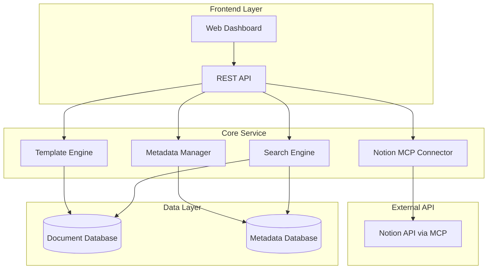

# Design Document

## Overview

서비스기획 산출물 생성 및 NOTION MCP 관리 시스템은 Web/App 서비스 개발을 위한 기획 산출물을 자동 생성하고, NOTION MCP를 통해 체계적으로 관리하는 시스템입니다. 이 시스템은 단일 서비스 아키텍처를 기반으로 하며, NOTION MCP API 연동을 통해 기획 산출물의 생성부터 관리까지의 통합된 워크플로우를 제공합니다.

## Architecture

### System Architecture



### Service Architecture

시스템은 다음과 같은 핵심 컴포넌트들로 구성됩니다:

1. **Template Engine**: 서비스기획 산출물 템플릿 생성 및 관리
2. **Notion MCP Connector**: NOTION MCP를 통한 산출물 동기화 및 관리
3. **Metadata Manager**: 산출물 메타데이터 및 버전 관리
4. **Search Engine**: 산출물 검색 및 의존성 관리

## Components and Interfaces

### 1. Template Engine

**책임**: 서비스기획 산출물 템플릿 생성 및 관리

**주요 컴포넌트**:
- `ServicePlanTemplateEngine`: 5가지 기획 산출물 템플릿 생성
- `TemplateValidator`: 생성된 산출물 구조 검증
- `ContentGenerator`: 템플릿 기반 콘텐츠 자동 생성

**인터페이스**:
```typescript
interface TemplateEngine {
  generateServiceOverview(projectInfo: ProjectInfo): Promise<ServiceOverview>
  generateFeatureSpec(features: Feature[]): Promise<FeatureSpec>
  generateScreenDefinition(screens: Screen[]): Promise<ScreenDefinition>
  generateAPISpec(endpoints: APIEndpoint[]): Promise<APISpec>
  generateDatabaseDesign(entities: Entity[]): Promise<DatabaseDesign>
}

enum ServicePlanDocumentType {
  SERVICE_OVERVIEW = 'service_overview',
  FEATURE_SPEC = 'feature_spec',
  SCREEN_DEFINITION = 'screen_definition',
  API_SPEC = 'api_spec',
  DATABASE_DESIGN = 'database_design'
}
```

### 2. Notion MCP Connector

**책임**: NOTION MCP를 통한 산출물 동기화 및 관리

**주요 컴포넌트**:
- `NotionMCPClient`: Notion MCP API 클라이언트
- `PageManager`: Notion 페이지 생성 및 업데이트 관리
- `SyncManager`: 산출물과 Notion 페이지 간 동기화
- `LinkManager`: 산출물 간 의존성 링크 관리

**인터페이스**:
```typescript
interface NotionMCPConnector {
  createServicePlanPage(document: ServicePlanDocument): Promise<NotionPage>
  updateServicePlanPage(pageId: string, document: ServicePlanDocument): Promise<NotionPage>
  linkRelatedPages(sourcePageId: string, relatedPageIds: string[]): Promise<void>
  syncAllDocuments(projectId: string): Promise<SyncResult>
  getPageStatus(pageId: string): Promise<PageStatus>
}
```

### 3. Metadata Manager

**책임**: 산출물 메타데이터 및 버전 관리

**주요 컴포넌트**:
- `MetadataExtractor`: 산출물에서 메타데이터 자동 추출
- `VersionTracker`: 산출물 버전 및 변경이력 관리
- `DependencyManager`: 산출물 간 의존성 관리

**인터페이스**:
```typescript
interface MetadataManager {
  extractMetadata(document: ServicePlanDocument): Promise<DocumentMetadata>
  trackVersion(documentId: string, changes: DocumentChanges): Promise<Version>
  updateDependencies(documentId: string, dependencies: string[]): Promise<void>
  getChangeHistory(documentId: string): Promise<ChangeHistory[]>
}
```

## Data Models

### Service Plan Document Model
```typescript
interface ServicePlanDocument {
  id: string
  projectId: string
  type: ServicePlanDocumentType
  title: string
  content: ServicePlanContent
  metadata: ServicePlanMetadata
  version: number
  createdAt: Date
  updatedAt: Date
  dependencies: string[]
  notionPageId?: string
}

interface ServicePlanMetadata {
  serviceType: 'web' | 'app' | 'hybrid'
  developmentStage: 'planning' | 'design' | 'development' | 'testing' | 'deployment'
  category: string
  tags: string[]
  priority: 'high' | 'medium' | 'low'
  reviewStatus: 'draft' | 'review' | 'approved' | 'rejected'
}

interface ServicePlanContent {
  serviceOverview?: ServiceOverviewContent
  featureSpec?: FeatureSpecContent
  screenDefinition?: ScreenDefinitionContent
  apiSpec?: APISpecContent
  databaseDesign?: DatabaseDesignContent
}
```

### Notion MCP Integration Model
```typescript
interface NotionMCPConnection {
  id: string
  workspaceId: string
  databaseId: string
  status: 'connected' | 'disconnected' | 'error'
  lastSync: Date
  config: NotionMCPConfig
}

interface NotionPage {
  id: string
  title: string
  url: string
  properties: Record<string, any>
  content: any
  lastModified: Date
}

interface SyncResult {
  documentId: string
  notionPageId: string
  status: 'success' | 'failed' | 'partial'
  syncedAt: Date
  errors: string[]
}
```

### Version and Change Tracking Model
```typescript
interface Version {
  id: string
  documentId: string
  versionNumber: number
  changes: DocumentChanges
  createdAt: Date
  createdBy: string
}

interface DocumentChanges {
  added: string[]
  modified: string[]
  deleted: string[]
  summary: string
}

interface ChangeHistory {
  documentId: string
  versions: Version[]
  totalChanges: number
  lastModified: Date
}
```

## Error Handling

### Error Categories
1. **Template Generation Errors**: 산출물 템플릿 생성 실패
2. **Notion MCP Integration Errors**: Notion MCP API 연동 실패
3. **Document Synchronization Errors**: 산출물 동기화 오류
4. **Metadata Processing Errors**: 메타데이터 처리 오류

### Error Handling Strategy
```typescript
interface ErrorHandler {
  handleTemplateError(error: TemplateError): Promise<void>
  handleNotionMCPError(error: NotionMCPError): Promise<void>
  handleSyncError(error: SyncError): Promise<void>
  retryOperation(operation: Operation, maxRetries: number): Promise<any>
  logError(error: Error, context: any): void
}

class NotionMCPRetryPolicy {
  maxRetries: number = 3
  backoffStrategy: 'exponential' | 'linear' = 'exponential'
  retryableErrors: string[] = ['NETWORK_ERROR', 'TIMEOUT', 'RATE_LIMIT', 'NOTION_API_ERROR']
}
```

## Testing Strategy

### Unit Testing
- 각 컴포넌트의 핵심 로직 단위 테스트
- Mock을 활용한 Notion MCP API 의존성 격리
- 서비스기획 산출물 템플릿 생성 및 메타데이터 관리 테스트

### Integration Testing
- Notion MCP API 연동 테스트
- 산출물 동기화 프로세스 테스트
- 템플릿 생성부터 Notion 페이지 생성까지의 end-to-end 테스트

### API Testing
- REST API 엔드포인트 테스트
- API 응답 형식 및 오류 처리 테스트
- 산출물 CRUD 및 검색 API 테스트

### Performance Testing
- 대량 산출물 생성 성능 테스트
- Notion MCP API 호출 최적화 테스트
- 동시 산출물 생성 및 동기화 테스트

### Test Environment Setup
```typescript
interface TestConfig {
  mockAPIs: {
    notionMCP: boolean
  }
  testDatabase: string
  testNotionWorkspace: string
  testDataSets: string[]
}
```

이 설계는 서비스기획 산출물 생성과 NOTION MCP를 통한 관리에 특화된 단순하고 효율적인 아키텍처를 제공합니다.