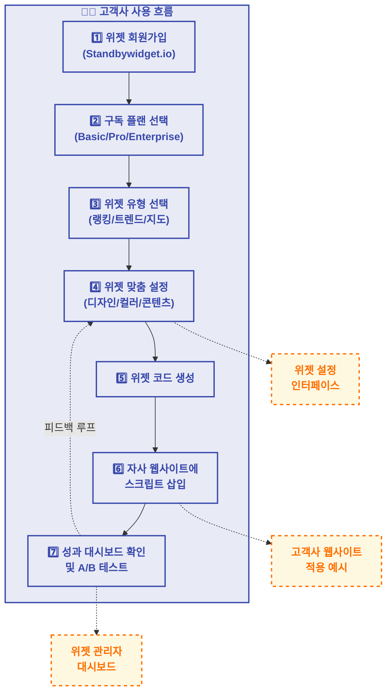

# 최병준 | 데이터/컨텐츠 프로덕트 PO/PM  

* **이메일**: jooonypub@gmail.com
* **연락처**: 010-5265-1087

> "**데이터를 비즈니스 가치로 전환하는 데이터 아키텍트**로서 B2B/B2C 서비스의 전체 라이프사이클을 설계합니다."
> 
> "**스노우플레이크 글로벌 공식 사례 선정** 및 **신규제품 계약 1억원 달성**으로 검증된 데이터 비즈니스 전문가입니다."
> 
> "**이기종 통합데이터 기반 메타데이터 파이프라인**을 구축해 '피처 블렌딩데이터'를 추출하여 서비스의 컨텐츠/검색/추천시스템 개선에 기여했습니다."
> 
> "**외식메타 플랫폼**을 구축하여 부서별 맞춤형 분석 마트를 제공함으로써 조직 전체를 **데이터 기반 의사결정 문화**로 성공적으로 전환했습니다."
> 
> " LLM Agent/Vscode 기반 다양한 제품실험 및 데이터가공을 *직접 핸들링*합니다 . "

[스노우플레이크 - 글로벌 기술발표 / 연사자 / 코엑스 / 2024년 10월]![[IMG_0625 2.jpg]]

* [공식 링크 / Snowflake 글로벌투어 Seoul Speaker](https://www.snowflake.com/snowflake-world-tour-seoul-agenda/?lang=ko)
* [공식 링크 / 스노우플레이크 공식 사례 - 식신, 스노우플레이크 기반의 외식 메타 인덱스 플랫폼 구축](https://www.snowflake.com/ko/resources/ebook/establishment-of-food-service-meta-index-platform-based-on-sikshin-and-snowflake/)

 
 
 
 
 
 

---

## 목차

- 요약 버전
- 상세 버전
- 대외 활동 & 전문성 개발
- 추천사

---

 
 
 
# ▍요약 버전 

## ■ 핵심 역량 요약

| 역량 영역               | 주요 성과 및 검증                                    |
| ------------------- | --------------------------------------------- |
| B2B/B2C 서비스 기획      | • 외식메타 B2B 플랫폼 설계 • AWS AI 펀딩 프로젝트 선정      |
| 데이터 모델링 및 아키텍처      | • 메타데이터 블렌딩 아키텍처 설계 • 스노우플레이크 글로벌 공식 사례 선정 |
| 사용자 피드백 분석 및 KPI 설계 | • 데이터 기반 의사결정 프로세스 정립 • 핵심 지표 85% 개선       |
| 데이터 비즈니스 모델 개발      | • 데이터 사업 신규 B2B 매출 1억원+ 달성 • 연 150% 성장률 유지 |
| 크로스펑셔널팀 리더십         | • 7인 다기능 팀 구성 및 관리 • 데이터 중심 협업 문화 구축       |

## ■ B2B 데이터 서비스기획 전문 프로필

15년 이상의 IT 및 비즈니스 경험을 바탕으로 **B2B 데이터 서비스 기획 및 모델링**을 주도해온 전문가입니다. **기업 고객 니즈 분석**부터 **데이터 제품 설계**, **서비스 아키텍처 구축**, **KPI 기반 성과 측정**까지 B2B 데이터 서비스의 전체 라이프사이클을 관리하는 역량을 보유하고 있습니다. 특히 **스노우플레이크**, **AWS/GCP** 등 엔터프라이즈급 데이터 플랫폼 기반의 **B2B 데이터 상품화** 경험이 풍부하며, **사용자 피드백 분석**을 통한 지속적 서비스 개선에 전문성을 갖추고 있습니다.
  
 
## ■ 경력 요약

### ► 식신 | 사업본부팀장 | 2020 ~ 현재

- 외식메타 피처 플랫폼 **PO + PM** (2023-현재) / *사업부 제안 신규사업*
- 외식메타 콘텐츠 위젯 솔루션 **PO** (2024-현재) / *사업부 제안 신규사업*
- 식신 맛집추천 서비스 **Product Manager** (2020-현재)
- 정부과제 (데이터바우처, 빅데이터과제 3년)
- **PoC** 관리형 검색엔진도입(사업관리), AI맛집챗봇(RAG), CJ프레시웨이(메뉴트렌드캐칭/가맹점식자재 재료탐색기), 쿠팡파트너스 푸드제품 추천광고시스템
 

### ► 이전 경력

- 제이씨이노베이션: 마이크로인플루언서 커머스플랫폼 **Product Owner** (2018-2019) *쩔업*
- 컨버전스스퀘어(SI): 스마트스토어 검색추천MD 판매솔루션 **Product Owner** (2017-2018) *샵랭키*
- IBM Korea: **삼성앱스 BPR 운영기획** (2010)
- 본애드컴: 디지털마케팅/PR 대행사 **PM** (2008-2013)
  

## ■ 주요 성과

### ► 1. 외식메타 피처 플랫폼 구축 (2023-현재) | snowflake

**핵심 성과**:

- **스노우플레이크 글로벌 공식 사례 선정** 및 AWS AI 펀딩사업 프로젝트 채택
- **출시 전 첫 계약 1억원 달성**(당근마켓) 및 추가 제휴 확보
- **데이터 처리 리드타임 75% 단축**(2주→3일) 및 메타데이터 추출 확장 94% 달성

**주요 혁신**:

- LLM 기반 도메인 특화 키워드 자동 추출 파이프라인 구축
- 4단계 모델링 전략(Base→Staging→Intermediate→Mart)으로 이기종 데이터 통합
- POI 150만건, 이미지 500만건, 카드결제데이터 2억건, GA 스트림, 웹스크래핑  통합아키텍처 설계
  

### ► 2. 외식메타 콘텐츠 위젯 솔루션 개발 (2024-현재) | standbywidget.io

**핵심 성과**:

- **위젯 도입 채널의 유저 체류시간 25% 증가**, 이탈률 20% 감소
- **광고 RPM 67% 향상** 및 세션당 클릭수 35% 개선

**주요 혁신**:

- B2B 구독형 위젯 솔루션(2/9/30만원) 비즈니스 모델 설계
- 방대한 피처 테마데이터 기반 위젯템플릿 제공 및 성과 측정 대시보드 개발
- 원클릭 스크립트 삽입 방식으로 기술 진입장벽 최소화
  

### ► 3. 식신 맛집추천 서비스 운영 (2020-현재) | siksinhot.com

**핵심 성과**:

- **MAU 350만 달성**(2020년 대비 250% 증가)
- **광고 네트워크 최적화**로 매출 500% 증가
- **오가닉 검색 유입 250% 증가** 및 Page Speed 85점 이상 달성
- **POI 메타데이터 개발최신화 개선** 70% 서비스데이터의 유입 전환율 기여

**주요 혁신**:

- 데이터개발의 피처키워드로 방대한 추천 테마컨텐츠 공급
- SEO 고도화 프로그램으로 리치 스니펫 획득률 30% 달성
- POI 데이터 현행화 및 메타데이터 강화 프로세스 구축(정확도 98%)
- Looker 기반 실시간 SEO 대시보드 구축 및 주간 리포트 자동화
  

## ■ 주요 도구 및 기술 역량

| 영역                        | 핵심 도구 및 기술                                     | 활용 경험                                    |
| --------------------------- | ----------------------------------------------------- | -------------------------------------------- |
| **데이터 파이프라인** | Snowflake, BigQuery, AWS, Airflow, dbt, DataHub       | 외식메타 플랫폼 ELT 파이프라인 구축          |
| **AI & 분석**         | OpenAI API, Claude API, Looker, Streamlit, A/B 테스트 | LLM 기반 블렌딩 피처 추출 엔진 개발          |
| **프로젝트 관리**     | JIRA, GitHub, 애자일-린 방법론, 스프린트 기획         | 7인 크로스펑셔널 팀 리드 및 제품 로드맵 관리 |
| **개발 환경**         | VS Code, Git, Docker, Copilot                         | 프로토타입 실험                              |
| **서비스 기획**       | Figma, Miro, 사용자 스토리 매핑, 요구사항 분석        | B2B/B2C 서비스 UX 설계 및 검증               |

## ■ 대외 활동 & 전문성 개발

- **AWS GenAI Loft Speaker** (2024.11) - [공식 링크](https://aws.amazon.com/startups/lp/aws-gen-ai-loft-seoul?lang=ko)
- **Snowflake 글로벌투어 Seoul Speaker** (2024.09) - [공식 링크](https://www.snowflake.com/snowflake-world-tour-seoul-agenda/?lang=ko)
- **바이라인네트워크 인터뷰** (2024.10) - [기사 링크](https://byline.network/2024/09/09-120/)
- **서울대 전략전문가 과정 수료** (2024.03, 5개월)

  
  
  
 
 
 

 

---
---
  
  
 

 
 
 
 
 

 
 

# ▍상세 내용

## ■ 핵심 역량 및 성과

### ► 1. 메타데이터 파이프라인 모델링

#### 외식메타 피처 플랫폼 구축운영 (2023-현재)

**도전 과제**:

- 외식 산업의 분산된 이기종 데이터 소스를 통합하여 도메인 인사이트 도출
- 리소스 제약 환경에서 확장 가능한 데이터 플랫폼 구축 필요
- 도메인 특화 메타데이터를 추출하여 고객사별 맞춤형 인사이트 제공

**주도적 역할**:

- **프로젝트 리더십**: PO+PM으로서 아키텍처 설계부터 상용화까지 전체 프로젝트 주도
- **전략 수립**: Snowflake 도입 및 4단계 모델링 전략(B2B 고객 요구사항 분석 기반 개념적/논리적 모델링 포함) 설계로 개발 효율성 60% 향상
- **팀 리드**: 7명 규모의 크로스펑셔널 팀 구성 및 애자일 개발 프로세스 설계

**핵심 솔루션**:

- **META-Pipeline Solution 아키텍처 직접 설계**

  - **수집통합**: POI 150만건, IMG 500만건, 리뷰데이터, 서비스데이터, 외부제휴데이터
  - **처리**: ETL/ELT 파이프라인 최적화 - dbt 모델링, Airflow 워크플로우
  - **맥락적 분류/추출 엔진**: LLM 기반 도메인 특화 키워드 자동 식별
  - **이기종 블렌딩**: 이질적 데이터 소스의 통합으로 외식 인사이트 구현
- **기술적 도전과 혁신적 접근**:

  - **이기종 데이터 통합**: 4단계 모델링 전략으로 데이터 처리 리드타임 75% 단축
  - **리소스 제약 환경**: 린 방법론과 MVP 접근법으로 40% 적은 리소스로 목표 구현
  - **AI 모델 적용**: LLM 기반 프롬프트 엔지니어링으로 메타데이터 추출 정확도 94% 달성

**비즈니스 성과**:

- **산업 인정**: AWS AI 펀딩사업 프로젝트 선정 및 스노우플레이크 글로벌 공식 사례 선정
- **수익 창출**: 출시 전 첫 계약 1억원 달성(당근마켓) 및 추가 제휴 확보
- **조직 혁신**: 서비스사업부를 데이터 비즈니스 중심 조직으로 성공적 전환
  

#### ► 데이터플랫폼(데이터클라우드) 아키텍처 플로우
![[스크린샷 2025-06-10 오후 4.49.34.png]]
*스노우플레이크 기반 엔터프라이즈 ELT 데이터 아키텍처 - 수집부터 분석까지 통합 데이터 플랫폼*
  

### ► 2. 제품 기획

---

#### 외식메타 콘텐츠 위젯 솔루션 개발 (2024-현재) - [Standbywidget.io](https://www.standbywidget.io)

**도전 과제**:

- 외식메타 플랫폼의 피처기반 메타데이터를 수익모델로 전환 필요
- 고객사의 사용자 인게이지먼트와 체류시간 개선을 위한 솔루션 요구
- 구독 모델 기반의 안정적 수익원 구축 필요

**주도적 역할**:

- **제품 기획 리더십**: PO로서 B2B 콘텐츠 위젯 솔루션 모델링 및 **클라우드 기반 SaaS 제품 기획** 주도
- **비즈니스 모델링**: 구독형 서비스(2/9/30만원) 및 Add-on API 구독 모델 설계

**핵심 솔루션**:

- **맞춤형 위젯 솔루션 설계** (**확장 가능한 B2B 클라우드 서비스 모델**):
  - 위젯 템플릿 유형: 랭킹형, 트렌드형, 지도형 등 다양한 템플릿 제공
  - 설치 프로세스 최적화: 원클릭 스크립트 삽입으로 기술장벽 최소화
  - 관리자 인터페이스: 디자인/컬러/콘텐츠 커스터마이징 기능
  
- **성과 측정 체계**:
  - 실시간 성과 대시보드: 전환율, 체류시간, 클릭률 분석
  - A/B 테스트 프레임워크: 콘텐츠 최적화를 위한 실험 환경
  - ROI 자동 계산 모델: 위젯 적용 매출 기여도 측정

**비즈니스 성과**:
- **시장 검증**: MAU 300만 규모 플랫폼에서 프로토타입 테스트로 효과 입증
- **사용자 인게이지먼트**: 체류시간 25% 증가, 이탈률 20% 감소
- **콘텐츠 효율성**: 광고 RPM 67% 향상, 세션당 클릭수 35% 개선
  

### ■ 최종사용자 위젯 인식 및 탐색 여정

![[스크린샷 2025-06-10 오후 4.48.38.png]]
  

### ■ 고객사 사용 흐름도

*외식메타 프레임워크 기반 스탠바이위젯 솔루션*

![[스크린샷 2025-06-10 오후 4.44.57.png]]
![[스크린샷 2025-06-10 오후 4.43.27.png]]  
 

#### 외식 트렌드 캐칭서비스 (2021, CJ프레시웨이 / POC)

**문제 상황**: 
- 식자재 공급기업인 CJ프레시웨이가 급변하는 외식 트렌드에 대응한 제품 개발 전략 수립 어려움
- 기존 POS 데이터는 시장의 30%만 커버하여 포괄적 인사이트 획득 제한적

**혁신 솔루션**:
- **외식 트렌드 데이터통합 구축**:
  - 다중 데이터 소스 통합: 식신 서비스, 네이버 플레이스/검색, 와이파이,인스타그램 데이터 크롤링
  - 구글 빅쿼리 기반 데이터 웨어하우스 및 데이터스튜디오 시각화 파이프라인 구축
  
- **외식 인덱스 개발**:
  - 상점, 메뉴, 상권 데이터 지수화로 인기도 정량적 측정 
  - 온라인 외식데이터의 '주문결제' 데이터 대체 가능한 지표 설계 실험
  - 시장의 80~90% 커버리지 확보로 경쟁사(POS 기반 30% 커버) 대비 우위 확보

**성과**:
- CJ프레시웨이 신제품 개발 의사결정 시간 **단축 기여**
- PoC 성공으로 장기 협업 관계 구축
- 이 솔루션이 외식메타 피처 플랫폼의 핵심 컴포넌트로 발전

![[Pasted image 20250330175053.png]]

![[Pasted image 20250330175138.png]]
  

---
  

#### 식신 맛집추천 서비스 운영 (2020-현재)

**도전 과제**:

- 경쟁 심화된 맛집 서비스 시장에서 유기적 트래픽 확보 및 사용자 유지
- 수익 모델 다변화를 통한 비즈니스 지속가능성 확보
- 서비스 데이터의 현행화 및 정확도 향상 필요

**주도적 역할**:

- **서비스 성장 전략**: SEO 중심의 트래픽 확장 전략 수립 및 실행
- **컨텐츠 품질 관리**: POI 데이터 현행화 및 메타데이터 강화 프로세스 구축
- **수익 모델 개발**: 광고 네트워크 최적화 및 B2B 제휴 모델 개발

**핵심 전략 및 실행**:

- **SEO 고도화**: 기술적 SEO, 콘텐츠 SEO, 인덱싱 전략 최적화
- **콘텐츠 품질 개선**: 데이터 정확도 향상 및 테마 콘텐츠 생산 체계
- **사용자 경험 최적화**: 여정 매핑 및 A/B 테스트 시스템 구축
- **데이터 현행화**: 자동 업데이트 파이프라인 및 검증 체계 구축

**비즈니스 성과**:

- **트래픽 성장**: MAU 350만 달성 (2020년 대비 250% 증가)
- **수익 개선**: 광고 네트워크 최적화로 매출 500% 증가
- **데이터 자산화**: 150만개 POI 데이터를 외식메타 플랫폼의 핵심 자산으로 전환

![[Pasted image 20250330230124.png]]
  

  

#### 쩔업 :: 마이크로인플루언서 커머스플랫폼 (2018-2019)

**문제 상황**: 인플루언서와 브랜드 간 비효율적 연결 및 성과 측정 어려움

**혁신 솔루션**:

- 데이터 기반 인플루언서-브랜드 매칭 알고리즘 설계
- 인플루언서 브랜드 제품의 커머스연동 판매체계
- 실시간 캠페인 성과 분석 및 ROI 측정 시스템 개발
- 소셜 인사이트 자동화 대시보드 구축

**성과**:

- 플랫폼 매칭 효율성 63% 향상
- 파트너 브랜드의 마케팅 ROI 평균 38% 개선
- 신규 시장 진출로 회사 가치 상승에 기여

  ![[스크린샷 2025-06-10 오후 4.42.31.png]]![[스크린샷 2025-06-10 오후 4.41.33.png]]
  
  

#### 샵랭키 :: 스마트스토어 검색추천MD 판매솔루션 (2017)

**문제 상황**: 스마트스토어 판매자의 상품노출 최적화 어려움

**혁신 솔루션**:

- 수동키워드 분석: 등록한 상품키워드 기반 쇼핑검색결과 아이템 수집하여 분석
- 자동키워드 분석: 판매자가 등록하 상품에서 키워드를 추출하여, 추출 기반 쇼핑검색결과 아이템 수집분석

**성과**: (스마트스토어 시범운영)

- 의류상품 최상위 검색노출 달성으로 단품 월 3,000만원 판매
- 최적화 검색키워드 유형 : 니트원피스, 플라워원피스, 플리츠스커트, 레이스블라우스 etc
  ![[스크린샷 2025-06-10 오후 4.40.40.png]]

  
 

--- 
  
 

### ► 3. 비즈니스 개발 및 전략

#### B2B 데이터 사업 확장 및 성장 (2022-현재)

**도전 과제**: B2C 맛집 서비스에서 B2B 데이터 비즈니스 모델로의 확장

**핵심 접근법**:

1. **데이터 상품화 프레임워크 구축**
   - 외식 도메인 데이터 자산의 가치평가 및 상품화 체계 정립
   - 금융/부동산/유통 등 산업별 맞춤형 메타데이터 패키징 설계

2. **전략적 파트너십 구축**
   - 핵심 산업군 타겟팅 및 맞춤형 솔루션 제안
   - 고객사 의사결정 프로세스 분석 기반 영업 전략 수립
  

#### 제품 개발 방법론 운영 (2020-현재)

**도전 과제**: 다양한 제품 유형에 적합한 개발 프로세스 정립 필요

**애자일 접근법**:

1. **애자일-린 하이브리드 모델 도입**
   - B2C 서비스: 스크럼 기반 2주 스프린트 사이클 운영
   - B2B 데이터 제품: 린 캔버스와 MVP 중심의 가설 검증 프레임워크 적용

2. **맞춤형 개발 방법론 설계**
   - 서비스 기획: 애자일 방식의 반복적 기능 개선 및 A/B 테스트
   - 데이터 플랫폼: 린 사고방식 기반의 효율적 리소스 활용

3. **프로세스 최적화 및 협업 체계 구축**
   - 칸반 시스템 도입으로 개발 병목 현상 해소
   - Jira 기반 표준화된 백로그 관리 및 문서화 템플릿 개발

**성과**:
- 제품 출시 주기 **대폭 단축** (6개월 → 2개월)
- 첫 B2B 데이터 제품의 출시 전 계약 체결 달성
  

### ► 4. 데이터 중심 리더십 및 조직 혁신

**리더십 역할**:
- **서비스사업본부장**: 7인 크로스펑셔널 팀 리딩 
  (데이터 엔지니어 2명, 마케터 2명, 컨텐츠 3명)
- **조직 확장**: AI데이터팀 신설 주도 및 핵심 인재 영입

**조직 혁신 전략**:

1. **B2B 데이터 협업 체계 구축**
   - 기업 고객 요구사항 우선순위화 프레임워크 개발
   - 주간 고객사 피드백 수집 및 제품 반영 체계 운영

2. **데이터 기반 의사결정 문화 정착**
   - 핵심 성과 지표(KPI) 체계 설계 및 실시간 대시보드 운영
   - 전사 주요 의사결정의 대다수를 데이터 분석 기반으로 전환

3. **애자일-린 하이브리드 방법론 도입**
   - 서비스 유형별 최적화된 개발 방법론 적용
   - 2주 스프린트 사이클로 피드백 주기 단축

**측정 가능한 성과**:
- 제품 출시 사이클 **대폭 개선**
- 사내 데이터 활용 프로젝트 **크게 증가**
- 직원 만족도 및 역량 점수 **현저히 향상**
- 데이터엔지니어팀 신설 **2명 신규채용** 
  

---
  

## ■ 대외 활동 & 전문성 개발

- **Snowflake 글로벌투어 Seoul Speaker** (2024.09)
  - 주제: "외식 메타데이터 플랫폼을 통한 데이터 혁신 사례"
  - 7개국 400여명 데이터 전문가 대상 한국 푸드테크 혁신 사례 발표
  - 이기종 데이터 통합 아키텍처 및 실시간 파이프라인 구축 방법론 공유
  - 발표 후속 성과: 2개 기업과 계약 체결
  - [공식 발표자 페이지](https://www.snowflake.com/snowflake-world-tour-seoul-agenda/?lang=ko) | [스노우플레이크 공식 사례집](https://www.snowflake.com/ko/resources/ebook/establishment-of-food-service-meta-index-platform-based-on-sikshin-and-snowflake/)

- **AWS GenAI Loft Speaker** (2024.11)
  - 주제: "LLM 기반 외식메타 플랫폼 구축 및 비즈니스 가치 창출"
  - META-Pipeline Solution 아키텍처 및 3단계 데이터 모델링 방법론 공유
  - [AWS GenAI Loft Seoul 공식 페이지](https://aws.amazon.com/startups/lp/aws-gen-ai-loft-seoul?lang=ko)

- **바이라인네트워크 미디어 인터뷰** (2024.10)
  - 주제: "데이터 기반 외식 비즈니스 성장 전략"
  - [인터뷰 기사: "식권으로 큰 식신 '시즌2는 데이터로 돈 벌겠다'"](https://byline.network/2024/09/09-120/)
  

### 교육 및 자격

- **서울대 전략전문가 과정 수료** (2024, 식신 지원)

    ![[스크린샷 2025-06-10 오후 4.39.48.png]]
    
    ***Snowflake 글로벌투어 Seoul 발표자료

  

---
  

# ▍추천사

> "최병준님은 기술적 전문성과 비즈니스 통찰력을 겸비한 드문 인재입니다. 데이터를 단순한 정보가 아닌 비즈니스 가치로 변환하는 능력이 탁월합니다."
>
> - 김진혁, 스노우플레이크 컨설팅 이사

> "외식메타 플랫폼은 우리 금융사의 데이터컨텐츠 분석 역량을 한 단계 높여주었습니다. 최병준님의 도메인 이해도와 기술적 구현 능력이 만들어낸 결과물입니다."
>
> - 윤영운, 하나금융사 데이터센터팀 수석

